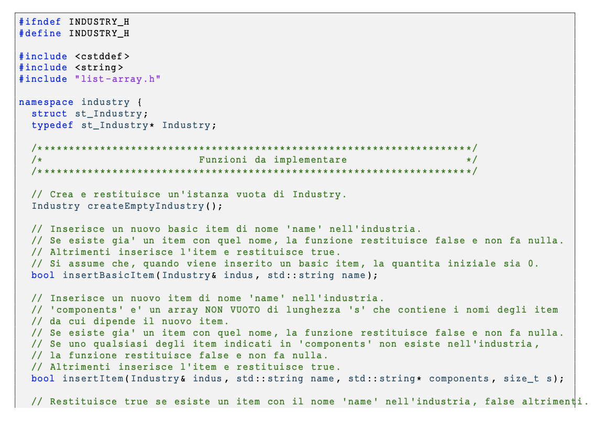
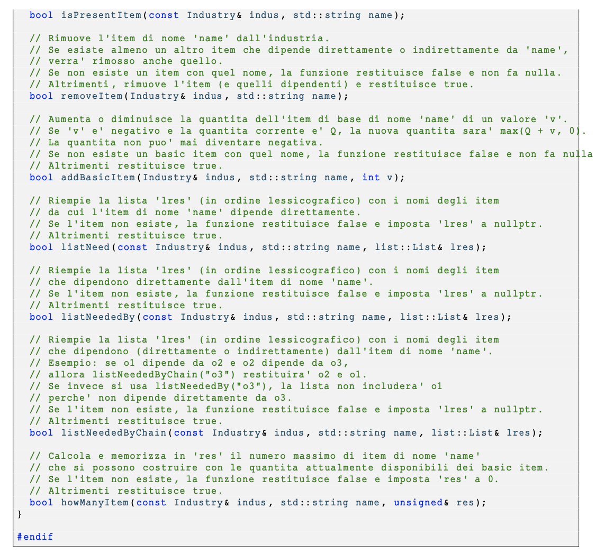

# ASD 24/25 - Laboratorio 10 Individuale

# 1 Introduzione

In questo laboratorio ci proponiamo di progettare e implementare una struttura dati a supporto della gestione dei processi
produttivi di un’industria semplificata. L’industria è in grado di fabbricare oggetti, detti _item_ , i quali possono essere di due tipi:

- **Basic item** : oggetti elementari, disponibili inizialmente in quantità finita, che non dipendono da altri item per essere
    ottenuti;
- **Item composti** : oggetti che possono essere prodotti solo a partire da uno o più altri item (basic o composti), secondo una
    specifica relazione di dipendenza.

Nella struttura dati vengono registrati gli item che l’industria può produrre e, per ciascuno, l’elenco degli altri item necessari
alla sua fabbricazione. Il sistema di dipendenze tra oggetti può essere rappresentato come un grafo orientato aciclico (DAG),
dove un arco da un item _A_ a un item _B_ indica che _B_ è necessario per produrre _A_.

Per comprendere meglio il contesto, consideriamo un esempio in cui l’industria può produrre i seguenti quattro item: _o_ 1 , _o_ 2 , _o_ 3
e _o_ 4 , con le seguenti dipendenze:

- Per fabbricare _o_ 2 è necessario _o_ 1 ;
- Per fabbricare _o_ 3 sono necessari _o_ 2 e _o_ 1 ;
- Per fabbricare _o_ 4 sono necessari _o_ 3 e _o_ 2.

In questo esempio, _o_ 1 è l’unico _basic item_ , mentre tutti gli altri dipendono (direttamente o indirettamente) da esso. Vogliamo,
in particolare, realizzare una funzione che — data la quantità disponibile di ogni basic item — calcoli quante unità di un item
qualsiasi possono essere effettivamente prodotte. Si assume che, per ogni relazione di dipendenza, sia richiesto esattamente un
esemplare di ciascun item componente per fabbricare un esemplare del prodotto finale.

Nel caso dell’esempio, se si dispone di un certo numero di _o_ 1 , è possibile determinare quante unità si possono ottenere degli
altri item. Di seguito, alcune casistiche illustrative:

- con 1 unità di _o_ 1 si può produrre 1 unità di _o_ 2 ;
- con 2 unità di _o_ 1 si possono produrre 2 unità di _o_ 2 , oppure 1 unità di _o_ 3 (1 per _o_ 1 diretto e 1 per produrre _o_ 2 );
- con 3 unità di _o_ 1 si possono produrre: 3 unità di _o_ 2 , oppure 1 unità di _o_ 3 , oppure 1 unità di _o_ 4 (2 unità per _o_ 3 , 1 per _o_ 2 );
- con 4 unità di _o_ 1 si possono produrre 4 unità di _o_ 2 , oppure 2 unità di _o_ 3 , oppure 1 unità di _o_ 4 ;
- con 5 unità di _o_ 1 si possono produrre 5 unità di _o_ 2 , oppure 2 unità di _o_ 3 , oppure 1 unità di _o_ 4 ;
- con 6 unità di _o_ 1 si possono produrre 6 unità di _o_ 2 , oppure 3 unità di _o_ 3 , oppure 2 unità di _o_ 4 ;
- ecc.

Le relazioni di dipendenza tra gli item descritti nell’esempio precedente possono essere rappresentate mediante il seguente grafo
orientato aciclico (DAG). In questo grafo, ciascun nodo rappresenta un item, e un arco diretto da un nodo _A_ a un nodo _B_ indica
che l’item _A_ necessita dell’item _B_ per essere prodotto.

# 2 Obiettivo

L’obiettivo del laboratorio individuale è implementare le funzionalità di base di una struttura dati che modella il funzionamento
di un’industria semplificata. L’industria è in grado di produrre oggetti (detti _item_ ), alcuni dei quali sono _basic item_ , ovvero
elementi di base che non dipendono da altri. Gli altri item possono essere prodotti solo se sono disponibili le relative componenti.
Lo studente dovrà progettare e realizzare il codice C++per:

- **Creare una nuova industria** inizialmente vuota.
- **Inserire nuovi item** :
    **-** _Basic item_ , cioè oggetti senza dipendenze;
    **-** _Item composti_ , definiti a partire da un insieme non vuoto di altri item (le componenti).
- **Verificare la presenza di un item** dato il suo nome.
- **Rimuovere un item** , eliminando ricorsivamente anche tutti gli item che ne dipendono direttamente o indirettamente.
- **Aggiornare la quantità di un basic item** , sommando (o sottraendo) un valore intero specificato. La quantità non può
    mai diventare negativa.
- **Ottenere le dipendenze dirette** di un item: data la descrizione dell’industria, è possibile ottenere la lista degli item
    necessari per produrre un certo item.
- **Ottenere gli item che dipendono** da un dato item, sia in modo diretto (immediato) sia lungo una catena di dipendenze.
- **Calcolare quante unità di un certo item** è possibile produrre, date le quantità attualmente disponibili dei basic item.

# 3 Dettaglio delle Funzioni da Implementare in C++

Un main per fare tests automatici vi sarà fornito, voi dovrete quindi progettare e implementare il codice delle funzioni presenti
nel fileindustry.cppche troverete, assieme ad altri file, all’interno del file .zip scaricabile da Aulaweb nella sezione relativa al
laboratorio 10. Più in dettaglio le funzioni da implementare sono le seguenti dichiarate nel fileindustry.h.
**Su aulaweb troverete degli esempi di chiamate di questa funzione per capire meglio cosa devono fare**

E’ possibile chiaramente inserire altre funzioni ausiliarie utili per l’implementazione.
Come potete notare alcune funzioni fanno uso di Liste. Per questo motivo vi forniamo un’implementazione già completa delle
liste nei filelist-array.cppelist-array.h.

# 4 Tests manuali e automatici

Potete iniziare ad implementare il laboratorio realizzando inoltre un vostro main per testare manualmente il funzionamento
della varie funzioni.
In seguito, vi forniremo un insieme di test automatici per controllare parzialmente la validità delle vostre funzioni.

# 5 Consegna

Per la consegna, creare unozipcon tutti i file forniti. In particolare:

- Tutti i file necessari a compilare il programma
- Una breve relazione (formato txt, doc o pdf) in cui vengono descritte le scelte implementative effettuate. Includete nella
    relazione anche il comando usato per compilare il vostro codice.

# 6 Punti e Valutazione

Il punteggio massimo di quattro punti si raggiunge non solo se le funzioni e le strutture dati sono corrette, ma anche se sono im-
plementate in modo efficiente e non ci sono problemi “di stile”. In particolare, sono elementi apprezzati ai fini della valutazione
(l’elenco non è esaustivo):

- corretta indentazione del codice
- uso di identificatori significativi
- introduzione di funzioni ausiliarie quando appropriato
- commenti significativi (non devono essere "traduzioni" del codice in lingua corrente, ma spiegazioni ad alto livello dell’al-
    goritmo eseguito e del motivo per cui avete fatto alcune scelte nell’implementazione).

La consegna è obbligatoria solo per coloro che hanno sottoscritto il patto.
Consegnare entro la scadenza riportata su Aulaweb.

